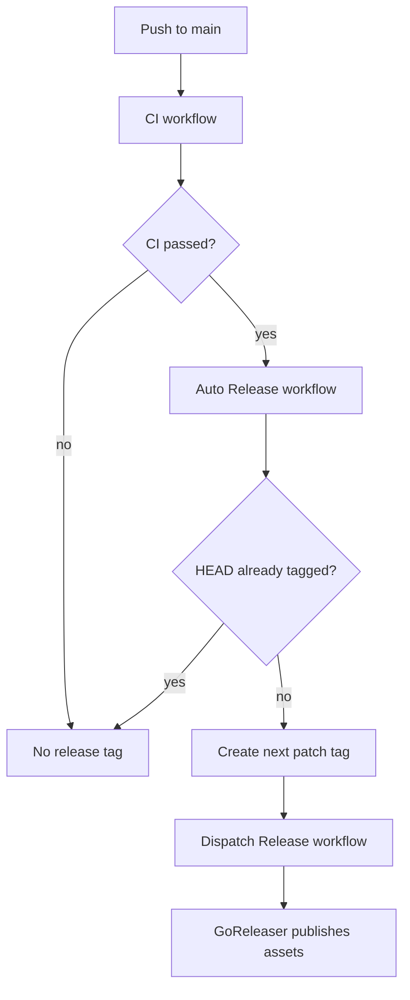

# Development

`ares` is a Go CLI built with Cobra. The source is intentionally split into
small packages:

- `cmd/` - CLI commands and output formatting
- `internal/system/` - host, distro, provider, SSH, and firewall detection
- `internal/config/` - YAML config loading and default config
- `internal/plugins/` - embedded plugin catalog
- `internal/plan/` - plugin selection and action planning
- `internal/apply/` - guarded apply engine, reports, backups, and verifiers
- `tests/` - smoke and container integration scripts
- `docs/adr/` - accepted safety and architecture decisions

## Build and Test

With [Flox](https://flox.dev) installed, the repo provides a complete local
toolchain for Go, markdownlint-cli2, golangci-lint, GoReleaser, pre-commit,
actionlint, git, and the Docker CLI:

```sh
flox activate
make ci
```

Without Flox, install the equivalent tools on your host and run:

```sh
make build
make test
make smoke
make release-artifact-smoke
make integration
make vet
```

`make pre-commit` runs the checks used by the local commit hook: Markdown lint,
source budgets, race-enabled Go tests, vet, golangci-lint, actionlint, and a
build. `make ci` extends that with security scans, smoke tests, container
integration, release artifact smoke tests, and release preflight checks.

`make ci` and `make pre-commit` both enforce source-size budgets. Source files
are capped at 500 lines by default, generated lockfiles and fixtures are
excluded, and flat source directories are capped at 30 direct files by default.
The same budget target also verifies that every provider advisory plugin has a
matching page under `docs/providers/`.

Security checks run as part of `make ci`:

- `govulncheck ./...`
- `gitleaks detect`
- `shellcheck` for installer, script, and test shell files

`make release-artifact-smoke` builds a release-shaped archive, installs from it,
then runs version, preflight JSON, and fixture apply checks through the installed
binary.

`make integration` runs lightweight Ubuntu/Debian container checks by default.
Use `ARES_FULL_INTEGRATION=1 make integration` to also pull and test the full
supported container set: Rocky, Fedora, Arch, openSUSE Leap, Alpine, Oracle
Linux, and Amazon Linux.

GitHub Actions also runs distro fixture smoke and container integration
matrices so Ubuntu, Debian, Rocky, Fedora, Arch, openSUSE Leap, Alpine, Oracle
Linux, and Amazon Linux failures are reported independently. The release
workflow runs the same supported-distro container matrix before publishing
artifacts.

Install the pre-commit hook after cloning:

```sh
pre-commit install
```

## Release Notes

Releases are cut from Git tags. After CI succeeds on `main`, the auto-release
workflow creates the next patch tag if the current commit is not already tagged,
then dispatches the release workflow for that tag. The release workflow can also
be run manually with a `vMAJOR.MINOR.PATCH` tag input.

The release workflow builds release artifacts and publishes platform archives
plus `checksums.txt`.



Current release assets:

- `ares_darwin_amd64.tar.gz`
- `ares_darwin_arm64.tar.gz`
- `ares_linux_amd64.tar.gz`
- `ares_linux_arm64.tar.gz`
- `checksums.txt`
