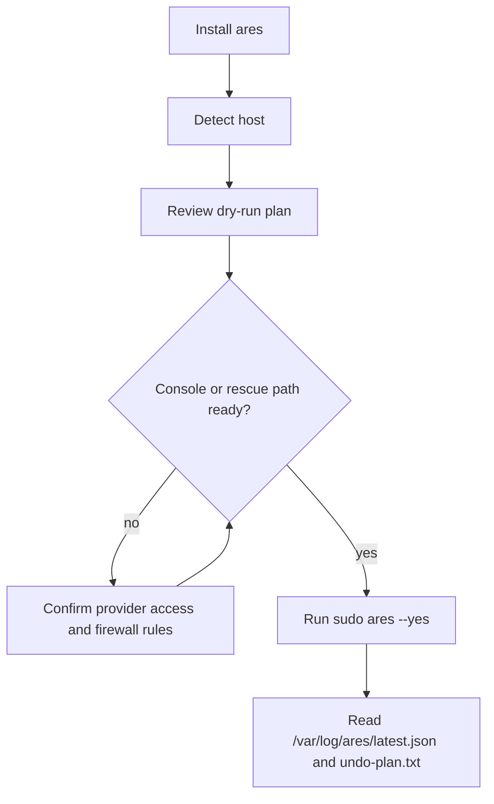

# Getting Started

`ares` is intended for the first SSH session on a newly rented VPS from a
provider such as DigitalOcean, Hostinger, Hetzner, Vultr, Linode, OVH, or AWS
Lightsail.

The default workflow is:

1. install the single `ares` binary
2. inspect the hardening plan
3. apply the plan after confirming SSH access and provider recovery options



## Install

Bootstrap from the latest GitHub release:

```sh
curl -fsSL https://raw.githubusercontent.com/dotbrains/ares/main/install.sh | sudo sh
```

Install from source with Go:

```sh
go install github.com/dotbrains/ares@latest
```

Build from a local checkout:

```sh
git clone https://github.com/dotbrains/ares.git
cd ares
make build
```

## First Run

Start with a dry run:

```sh
sudo ares --dry-run
```

`ares` detects the distro, package manager, init system, SSH service, active SSH
port, firewall backend, CPU architecture, and provider hint. It then prints the
selected plugins and actions.

Apply only after reviewing that plan:

```sh
sudo ares --yes
```

Apply mode requires both root privileges and `--yes`. Without both, `ares`
prints the plan and exits with an error before mutating the host.

## Profiles

The default profile is `basic`.

- `basic` - SSH hardening, distro-selected firewall, fail2ban, security updates,
  and sysctl baseline.
- `web` - `basic` plus inbound `80/tcp` and `443/tcp` firewall allowances.
- `strict` - `basic` plus stricter fail2ban defaults and root-lock guidance.

Use a profile for one run:

```sh
sudo ares --profile web --dry-run
sudo ares --profile web --yes
```

Or set it in `~/.config/ares/config.yaml`; see
[Configuration](configuration.md).

## Before Applying

On remote VPS hosts, confirm:

- you have a second terminal or provider console available
- the active SSH port reported by `ares detect` is correct
- provider firewalls allow that SSH port
- provider snapshots or rescue console access are available when possible

Provider plugins are advisory only. They record recovery reminders in the run
report; they do not call cloud APIs or configure provider-level firewalls.
