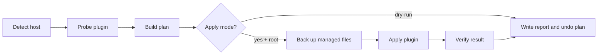
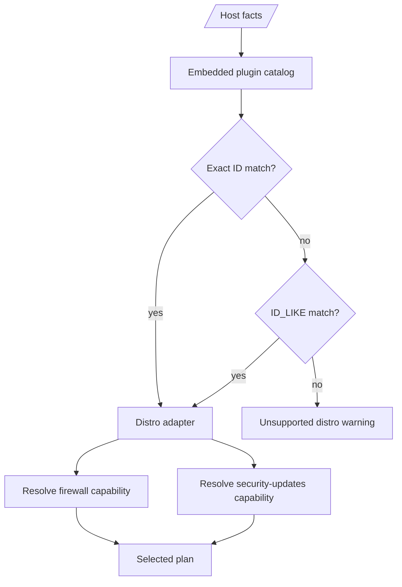

# Plugins

`ares` is modular by default. The core runner owns host detection, plan
selection, root and confirmation guards, report paths, backups, and final
reporting. Hardening behavior is selected through built-in or custom plugins.

The model is built around an embedded catalog, categories, capabilities,
metadata inspection commands, and copyable config snippets. Marketplace source
files live under `marketplace/plugins/<kind>/<id>.toml`, one file per plugin,
so new entries can be reviewed and owned independently as the catalog grows.
Unlike a package manager, `ares` does not automatically download or execute
remote plugin code.

## Lifecycle Contract

Every plugin is expected to fit this lifecycle:

```text
detect -> probe -> plan -> confirm -> backup -> apply -> verify -> report
```



The implementation currently enforces the host-level `confirm` guard for real
apply mode: root privileges and `--yes` are required. Built-in actions are
planned before mutation, and SSH/firewall actions are marked risky in the plan.

Custom plugins can declare `probe`, `plan`, `apply`, `verify`, and `rollback`
commands in config. `ares` executes custom `probe`, `apply`, and `verify`
commands with a timeout. If a custom plugin probe exits non-zero, `ares`
records the result and skips that plugin instead of running `apply`. Custom
command output can emit structured lines prefixed with `applied:`, `verified:`,
`skipped:`, or `failed:`; `ares` records those lines in the run report. `ares
rollback last --yes` executes custom `rollback` commands recorded in the latest
run report. `plan` is preserved as metadata for inspection and future richer
external orchestration.

## Built-Ins

Inspect the live embedded catalog:

```sh
ares plugins list
ares plugins show ssh-hardening
ares plugins snippet ssh-hardening
```

Current built-ins:

| Plugin | Purpose |
| --- | --- |
| `distro-ubuntu` | Use apt/systemd/Ubuntu service assumptions. |
| `distro-debian` | Use apt/systemd/Debian service assumptions. |
| `distro-rhel` | Use dnf/firewalld/RHEL-family assumptions. |
| `distro-fedora` | Use dnf/firewalld/Fedora assumptions. |
| `distro-arch` | Use pacman/nftables/Arch Linux assumptions. |
| `distro-opensuse` | Use zypper/firewalld/openSUSE Leap assumptions. |
| `distro-alpine` | Use apk/nftables/Alpine Linux assumptions. |
| `distro-oracle` | Use dnf/firewalld/Oracle Linux assumptions. |
| `distro-amazon` | Use dnf/firewalld/Amazon Linux assumptions. |
| `ssh-hardening` | Write `/etc/ssh/sshd_config.d/99-ares.conf`, validate sshd config, and reload SSH. |
| `firewall-ufw` | Install and enable UFW with active SSH allowed. |
| `firewall-firewalld` | Install and enable firewalld with active SSH allowed. |
| `firewall-nftables` | Write `/etc/nftables.conf` with active SSH allowed. |
| `fail2ban` | Install and enable a conservative SSH jail. |
| `unattended-upgrades` | Enable apt security updates without automatic reboots. |
| `dnf-automatic` | Enable dnf security updates. |
| `pacman-upgrade` | Apply Arch package upgrades. |
| `zypper-patches` | Apply openSUSE patches. |
| `apk-upgrade` | Apply Alpine package upgrades. |
| `sysctl-baseline` | Write conservative network hardening to `/etc/sysctl.d/99-ares.conf`. |
| `web-profile` | Allow inbound HTTP and HTTPS through UFW, firewalld, or nftables. |
| `strict-profile` | Apply stricter fail2ban defaults and record root-lock guidance. |
| `provider-*` | Record provider recovery reminders without mutating provider APIs. |

## Marketplace Layout

Plugin metadata is stored in per-plugin TOML files:

```text
marketplace/
  catalog.go
  plugins/
    builtin/
      ssh-hardening.toml
      firewall-ufw.toml
      provider-digitalocean.toml
```

Each file declares a single plugin:

```toml
id = "ssh-hardening"
name = "SSH hardening"
kind = "builtin"
summary = "Writes a managed sshd drop-in after preserving the active SSH port"
categories = ["ssh", "hardening"]
requires = ["ssh-service"]
capabilities = ["ssh-hardening"]
probe = "test -d /etc/ssh"
plan = "builtin:ssh-hardening:plan"
apply = "builtin:ssh-hardening:apply"
rollback = "builtin:ssh-hardening:rollback"
config = """
[plugins]
enabled = ["ssh-hardening"]
"""
```

The filename must match the plugin id. For example,
`marketplace/plugins/builtin/ssh-hardening.toml` must declare
`id = "ssh-hardening"`. The Go package in `marketplace/` embeds the directory
tree and sorts plugin files by path for stable CLI output.

## Distro Plugins

Distro plugins are selected from catalog metadata. The planner does not keep a
hard-coded list of supported distro IDs. It asks the catalog for a plugin in the
`distro` category whose `distros` entries match the detected `/etc/os-release`
`ID` first, then `ID_LIKE`.

Minimal distro adapter:

```toml
id = "distro-example"
name = "Example Linux adapter"
kind = "builtin"
summary = "Provides package, systemd, SSH, and service defaults for Example Linux"
categories = ["distro"]
capabilities = ["package-manager", "service-manager", "ssh-service"]
distros = ["example", "example-family"]
package_manager = "example-pkg"
init_system = "systemd"
firewall_backend = "nftables"
ssh_service = "sshd"
probe = "grep -q '^ID=example' /etc/os-release"
plan = "builtin:distro-example:plan"
apply = "builtin:distro-example:apply"
rollback = "builtin:distro-example:rollback"
config = """
[plugins]
enabled = ["distro-example"]
"""
```

Related plugins, such as firewalls and security updates, should declare
compatible `distros`, `requires`, and `capabilities`:

```toml
categories = ["updates", "hardening"]
requires = ["dnf"]
capabilities = ["security-updates"]
distros = ["example", "example-family"]
```

This lets `firewall-auto` and `security-updates` resolve through the catalog
instead of per-distro planner branches.



## Custom Plugins

Custom plugins are configured explicitly:

```yaml
plugins:
  custom:
    - name: tailscale-ssh
      probe: command -v tailscale
      plan: ares-plugin-tailscale-ssh plan
      apply: ares-plugin-tailscale-ssh apply
      verify: ares-plugin-tailscale-ssh verify
      rollback: ares-plugin-tailscale-ssh rollback
      timeout_seconds: 120
```

Guidelines for custom plugin commands:

- keep commands idempotent
- use `probe` to decide whether the plugin should run on the current host
- fail loudly on partial configuration
- preserve active SSH access when touching SSH or firewall settings
- write reversible changes or clear manual rollback steps
- avoid fetching remote scripts inside `apply`

Future remote marketplace support must require explicit confirmation plus
pinning, checksums, or signatures.

## Provider Plugins

Provider plugins are advisory. They record provider-specific recovery reminders
for cloud firewalls, snapshots, rescue consoles, and out-of-band access. They do
not mutate provider APIs or assume cloud credentials are available on the VPS.
