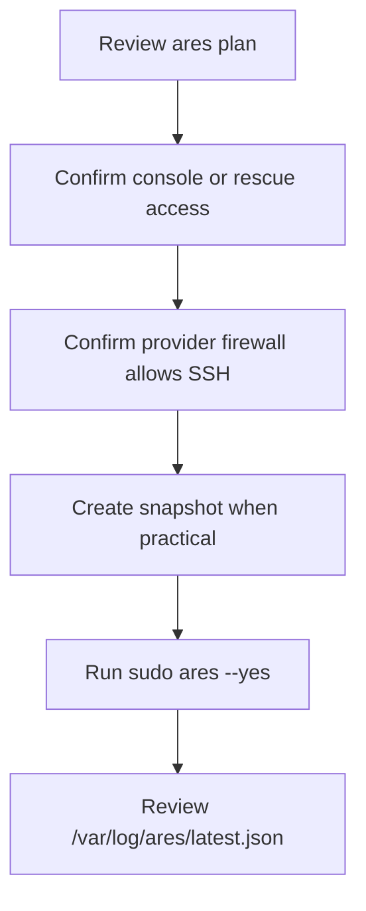

# Provider Recovery Notes

Provider plugins are advisory. They remind operators to verify console access,
provider firewalls, snapshots, and rescue paths before relying on host-only
hardening.

- [DigitalOcean](digitalocean.md)
- [Hetzner](hetzner.md)
- [Hostinger](hostinger.md)
- [AWS Lightsail](lightsail.md)
- [Linode/Akamai](linode.md)
- [OVH](ovh.md)
- [Vultr](vultr.md)
